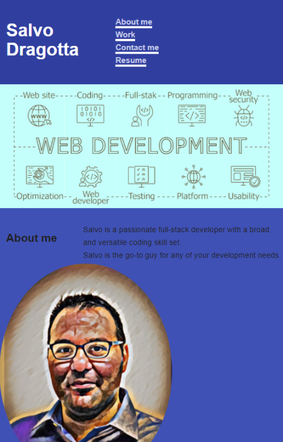

# Salvo Dragotta - Full Stack Web Developer

I am a Full-Stack Web Developer currently located in Sydney. This is my personal portfolio website that showcases my experience, education, recent projects, technical skill stack, contact information.

You can view my portfolio at [Salvo Dragotta - Full Stack Developer Professional Portfolio](https://mm-salvodragotta.github.io/full-stack-developer-professional-portfolio/).

## Mock-Up

The following image shows the web application's appearance and functionality:

## Education

### Technology Boot Camps at the University of Sydney

Technology Bootcamp is a collaboration between
the University of Sydney and Trilogy Education Services (Australia) Pty Ltd

[View Bootcamp - https://techbootcamp.sydney.edu.au/coding/](https://techbootcamp.sydney.edu.au/coding/)

## Recent Projects & Achievements

### Project 1

### Project 2

## Technical Skill Stack

### Front End

`HTML` `CSS` `JavaScript` `React` `JQuery` `Bootstrap` 

### Back End

`Node.js` `Nodemon` `Express`

### Computer Science

`Python` `Algorithms` `Data Structures` 

### Tools & Deployment

 `Git` `Github` `NPM` `Heroku`

